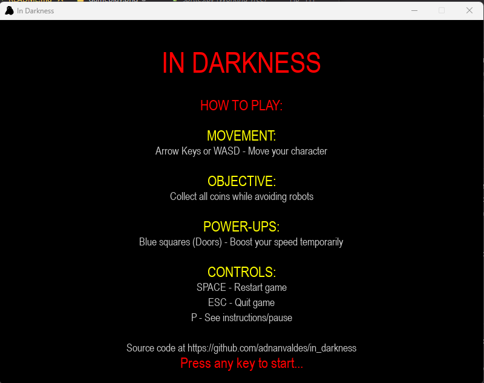
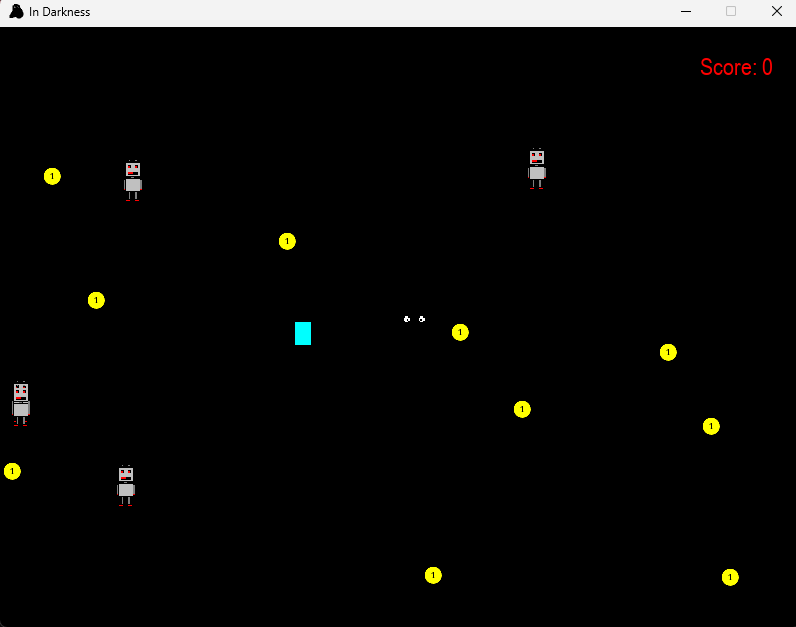
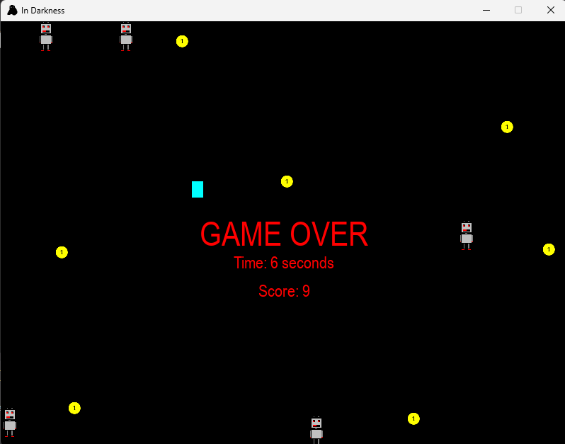

# In Darkness

**In Darkness** is a 2D arcade-style survival game developed using Python and Pygame. Created as the final project for the [University of Helsinki's Advanced Programming course](https://programming-25.mooc.fi/), the game challenges players to collect coins, avoid patrolling robots, and navigate the darkness with occasional speed boosts.

---

## 🎮 Gameplay

You control a **Monster** character that must:

* **Collect all coins** scattered across the map.
* **Avoid robots**, which end the game on contact.
* **Touch blue doors** to gain temporary speed boosts.

The goal is to survive, collect all the coins, and win before the robots catch you.

---

## 🕹️ Controls

| Key               | Action                      |
| ----------------- | --------------------------- |
| Arrow Keys / WASD | Move the Monster            |
| `P`               | Pause and view instructions |
| `SPACE`           | Restart the game            |
| `ESC`             | Quit the game               |

---

## 📸 Screenshots

### Title & Instructions Screen



### In-Game (Monster Collecting Coins)



### Game Over / You Won Screen



---

## 📦 Features

* **Dynamic difficulty**: Robot count increases with your score (if enabled in config).
* **Simple power-up system**: Doors temporarily increase player speed.
* **Clear game states**: Title screen, gameplay, pause, and game over views.
* **Modular codebase**: Separate configuration, sprites, and game loop for maintainability.

---

## 🧱 Code Structure

* `main.py`: Main game class `InDarkness`, handles the game loop and logic.
* `sprites.py`: Contains definitions for `Monster`, `Robot`, `Coin`, and `Door`.
* `config.py`: Centralized constants (window size, colors, fonts, difficulty).

---

## 🛠️ Installation

### Requirements

* Python 3.8+
* Pygame 2.6.1+

### Install dependencies

```bash
pip install pygame
```

### Run the game

```bash
python main.py
```

---

## 📚 Course Info

This game was created as the final project for:

**Advanced Programming**
University of Helsinki
📘 [Programming 25](https://programming-25.mooc.fi/)

---

## 📄 License

This project is intended for educational and demonstration purposes only. Feel free to modify and learn from it.